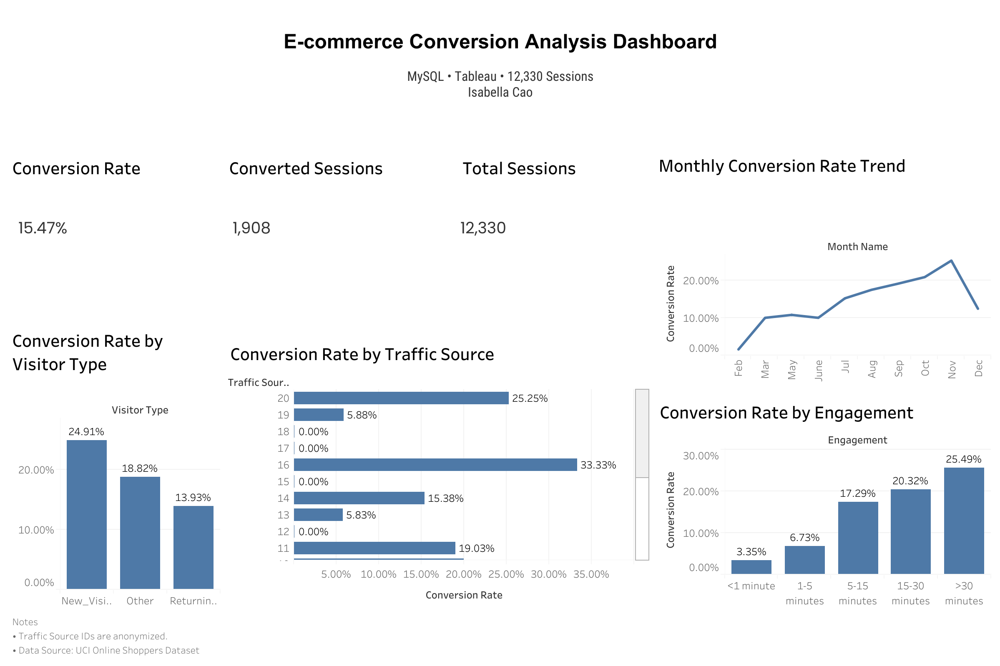

# Tableau Dashboard

This folder contains the packaged Tableau workbook for the e-commerce
conversion dashboard.

The dashboard explores:

- Overall conversion performance
- Conversion rate by visitor type
- Conversion rate by traffic source
- Monthly conversion patterns
- The relationship between product-page engagement and purchase conversion

## Dashboard Preview

## Interactive Dashboard

The interactive version is published on Tableau Public:

[View the interactive dashboard](https://public.tableau.com/views/Onlineshoppers/Dashboard1)

## File

- `ecommerce_conversion_dashboard.twbx`: Packaged Tableau workbook
